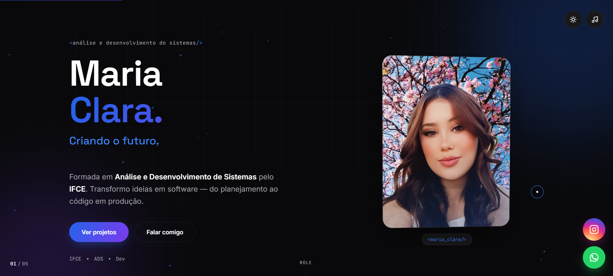
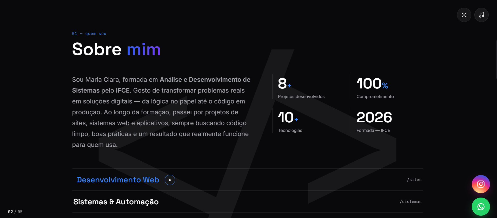

# Maria Clara — Portfólio

Site pessoal em página única (one-page) para apresentar quem sou, minha trajetória e os projetos que desenvolvi ao longo da formação em **Análise e Desenvolvimento de Sistemas**.

🔗 Seções: `Home` → `Sobre` → `Stack` → `Projetos` → `Contato`

## 📸 Preview

**Home**


**Sobre mim**


## 👩‍💻 Sobre mim

Sou Maria Clara, formada em **Análise e Desenvolvimento de Sistemas** pelo **IFCE**. Gosto de transformar problemas reais em soluções digitais — da lógica no papel até o código em produção. Ao longo da formação, passei por projetos de sites, sistemas web e aplicativos, sempre buscando código limpo, boas práticas e um resultado que realmente funcione para quem usa.

| | |
|---|---|
| **8+** | Projetos desenvolvidos |
| **100%** | Comprometimento |
| **10+** | Tecnologias |
| **2026** | Formada — IFCE |

**Áreas de atuação:** Desenvolvimento Web · Sistemas & Automação · Aplicativos · UI/UX & Front-end

## 🛠️ Stack

| Tecnologia | | Tecnologia | |
|---|---|---|---|
| HTML5 | 98% | Git | 93% |
| CSS3 | 95% | GitHub | 90% |
| JavaScript | 92% | Firebase | 84% |
| React | 88% | Kotlin | 78% |
| Node.js | 85% | Android Studio | 80% |
| Figma | 87% | UI Design | 90% |

## 🚀 Projetos

| Projeto | Descrição | Tecnologias |
|---|---|---|
| **CB_Fitness** | Landing page para academia, com hero de impacto, contadores de estatísticas (alunos, professores, anos de história) e chamadas diretas para matrícula e horários de aula. | HTML, CSS, JavaScript |
| **CBflix** | Plataforma de streaming inspirada em serviços como Netflix, com catálogo de filmes e séries organizado por categorias, avaliações e cards interativos. | React, CSS, JavaScript |
| **CB Softworks** | Site institucional para software house, com apresentação animada dos serviços, mini-game interativo no código de exemplo e captação de orçamentos. | HTML, CSS, JavaScript |
| **CBOdonto** | Site para clínica odontológica com apresentação de especialidades, estatísticas de atendimento e botão direto de agendamento de consulta. | HTML, CSS, JavaScript |
| **Estoque+** | Sistema de gestão de estoque com autenticação via Google, painel de métricas, controle de produtos e relatórios de movimentação. | React, Firebase |
| **Wemilly Rocha Beauty** | Site para especialista em alongamento de cílios, com identidade visual delicada, agendamento direto pelo WhatsApp e integração com Instagram. | HTML, CSS, JavaScript |
| **Sombra no Campus** | Jogo 2D de suspense e exploração ambientado no IFCE de Jaguaruana, dividido em três fases. O jogador explora diferentes áreas da instituição, encontra pistas, supera desafios e desvenda os mistérios do campus em uma atmosfera sombria e imersiva. | Game Design, Pixel Art, JavaScript |

## 📁 Estrutura do projeto

```
maria-clara-portfolio/
├── assets/
│   ├── audio/          # Trilha sonora de fundo
│   ├── files/
│   │   └── curriculo-maria-clara.pdf   # Currículo para download na Home
│   ├── icons/
│   └── images/
│       └── projects/   # Capturas dos projetos exibidos na seção "Projetos"
├── css/
│   └── style.css
├── docs/
│   └── screenshots/     # Prints usados neste README
├── js/
│   └── script.js
├── index.html
├── robots.txt
├── sitemap.xml
└── README.md
```

## ✨ Funcionalidades

- Layout em tela cheia com navegação por scroll (seções em painéis)
- Alternância entre tema claro e escuro (salva a preferência no navegador)
- Música de fundo opcional, ativada manualmente pelo usuário
- Filtro de projetos por categoria (Todos / Sites / Sistemas / Jogos)
- Download do currículo em PDF direto pela Home
- Modal com detalhes de cada projeto
- Formulário de contato e atalhos diretos para WhatsApp e Instagram

## 🖥️ Como executar localmente

Como é um site estático, basta abrir o `index.html` no navegador ou servir a pasta com um servidor local, por exemplo:

```bash
npx serve .
```

## 📬 Contato

- **E-mail:** mariaclara@email.com
- **Instagram:** [@clarabdll](https://www.instagram.com/clarabdll/)
- **WhatsApp:** [Chamar no WhatsApp](https://wa.me/5588994086279)

---

© 2026 Maria Clara — Análise e Desenvolvimento de Sistemas, IFCE.
