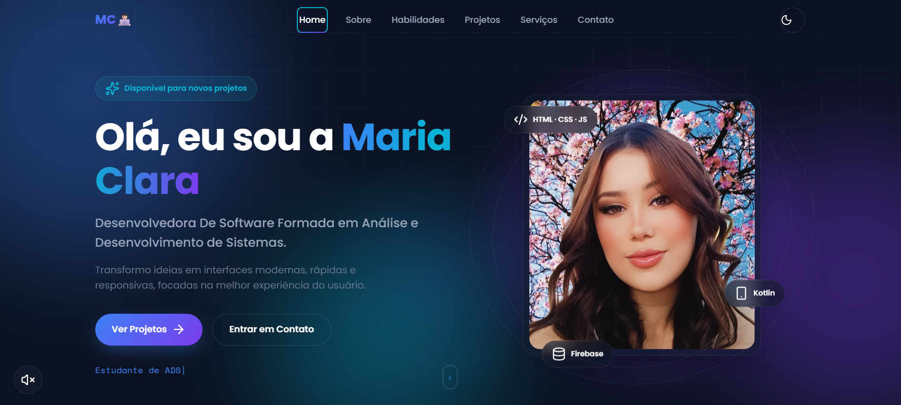
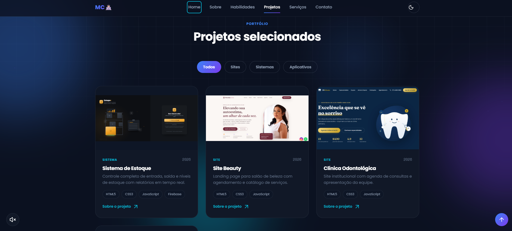

# 💻 Portfólio — Maria Clara

Portfólio pessoal desenvolvido para apresentar projetos, habilidades e formas de contato de **Maria Clara**, desenvolvedora Front-end e estudante de Análise e Desenvolvimento de Sistemas.

🔗 **[Ver site publicado](#)** _(coloque aqui o link depois de hospedar)_

---

## 📸 Screenshots

### Home


### Projetos


---

## ✨ Funcionalidades

- Design moderno com tema **claro/escuro** (alternável pelo usuário, salvo no navegador)
- Totalmente **responsivo** — se adapta a celular, tablet e desktop
- **Menu mobile** com animação e navegação por âncoras
- Seção de **projetos** com cards, filtro por categoria e modal com detalhes de cada projeto
- **Música de fundo** opcional, com botão de play/pause
- **Formulário de contato** que envia a mensagem direto pelo WhatsApp (sem backend/email)
- Animações suaves de entrada ao rolar a página (scroll reveal)
- Seção de **FAQ** com perguntas expansíveis (accordion)
- Botão de **voltar ao topo**
- Ícones via [Lucide Icons](https://lucide.dev)

---

## 🛠️ Tecnologias utilizadas

- **HTML5** — estrutura semântica
- **CSS3** — variáveis CSS, Grid, Flexbox, animações e media queries para responsividade
- **JavaScript (Vanilla)** — sem frameworks, interações e lógica escritas do zero
- **Lucide Icons** — ícones via CDN

---

## 📁 Estrutura do projeto

```
portfolio-maria-clara/
├── index.html          # Página principal
├── css/
│   └── style.css       # Estilos do site
├── js/
│   └── script.js       # Interações (menu, modal, tema, formulário, etc.)
├── img/
│   ├── perfil.jpeg
│   ├── logo.jpeg
│   └── projetos/        # Prints dos projetos exibidos no portfólio
├── audio/
│   └── trilha-tecnologia.mp3   # Música de fundo opcional
└── screenshots/         # Prints do site usados neste README
```

---

## 🚀 Como rodar localmente

Não precisa de instalação nem build — é só HTML, CSS e JS puros.

```bash
# Clone o repositório
git clone https://github.com/seu-usuario/portfolio-maria-clara.git

# Entre na pasta
cd portfolio-maria-clara

# Abra o index.html no navegador
```

Ou, se preferir rodar com um servidor local (recomendado, evita problemas de caminho de arquivo):

```bash
# Com Python instalado
python3 -m http.server 8000
# depois acesse http://localhost:8000
```

---

## 🌐 Como hospedar no GitHub Pages

1. Suba este projeto para um repositório no GitHub.
2. Vá em **Settings → Pages**.
3. Em **Source**, selecione a branch `main` e a pasta `/root`.
4. Salve — em alguns minutos o site estará no ar em:
   `https://seu-usuario.github.io/portfolio-maria-clara/`

---

## 📬 Contato

O formulário de contato do site envia a mensagem diretamente para o WhatsApp. Outras formas de contato estão disponíveis na própria seção **Contato** do site.

---

## 📄 Licença

Este projeto é de uso pessoal de Maria Clara. Sinta-se à vontade para se inspirar na estrutura, mas evite reutilizar o conteúdo e as imagens diretamente.
